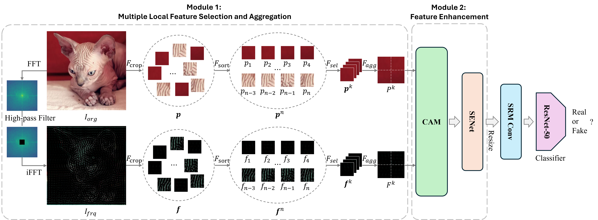
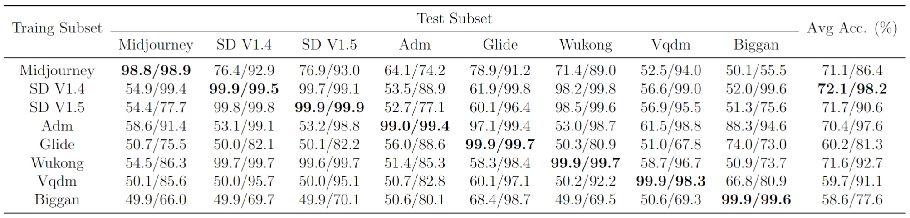

# 🎭 MLHFA ✨
This is the official code implementation of the paper:

**MLHFA: Multi-Local High-Frequency Attention and Feature Aggregation for Generalizable Deepfake Detection**

Yi Li, Xiping He, Dan He, Xiaoqin Xie, Xuyuan Liu, Xin Liu

---

## 📖 Introduction
**MLHFA** is a deepfake detection model with strong generalization capabilities for novel deepfake methods. It aggregates multiple local blocks, leverages high-frequency information for guidance, and enhances features using cross-attention and channel attention mechanisms. The model structure of this method is as follows:



---

## 🛠️ Installation
Follow these steps to set up the project:

1. **Clone the repository**:
   ```bash
   git clone https://github.com/AmyLee-github/MLHFA.git
   cd MLHFA
   ```
2. **Install dependencies**:
   ```bash
   pip install -r requirements.txt
   ```

---
## 🗂️ Datasets
We conducted training and testing on the [GenImage](https://github.com/GenImage-Dataset/GenImage) dataset, which is a general-purpose deepfake detection dataset containing various novel deepfake generation methods.

---

## 🚀 Usage
### 🔧 Pre-processing
Run the following command to pre-process the dataset:
```
python dataset_deal/save_fft_figures.py
```

### 🏋️‍♂️ Training and Validation
Run the following command to train the model:
```bash
sh train_val.sh
```

### 🧪 Testing
Test the trained model using:
```bash
sh test.sh
```

---

## 📊 Results
The experimental results of training and testing of ResNet-50 and our MLHFA method on different datasets. In each column, the first and second value represents the result of ResNet-50 and MLHFA, respectively.
